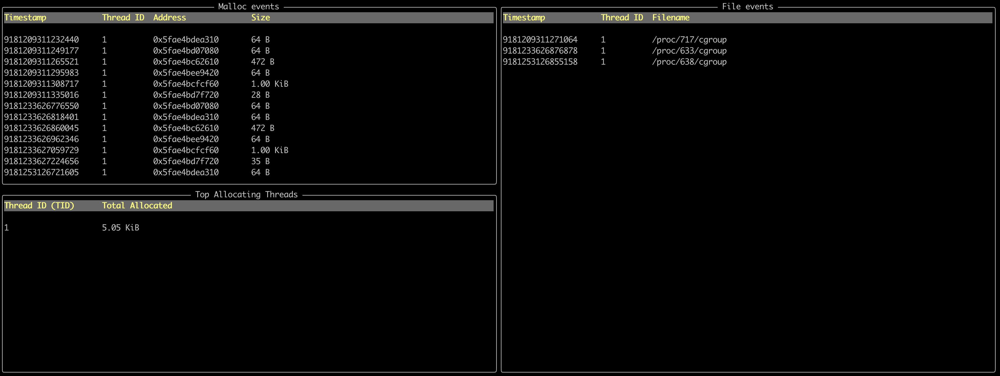

# proc-monitor

## Overview

Tool for monitoring process memory and file operations using linux eBPF.



Features:
1. Trace libc `malloc` calls 
2. Trace `sys_enter_openat` syscall
3. Track threads with the most amount of allocations

TODO:
* add tracing for other memory functions, i.e `calloc`, `realloc`, ..
* Track file IO by tracing `write`, `read` syscalls
* Add network tracing for network events
* Improve UI


## Prerequisites

1. stable rust toolchains: `rustup toolchain install stable`
1. nightly rust toolchains: `rustup toolchain install nightly --component rust-src`
1. (if cross-compiling) rustup target: `rustup target add ${ARCH}-unknown-linux-musl`
1. (if cross-compiling) LLVM: (e.g.) `brew install llvm` (on macOS)
1. bpf-linker: `cargo install bpf-linker` (`--no-default-features` on macOS)

## Build & Run

Use `cargo build`, `cargo check`, etc. as normal. Run your program with:

```shell
cargo run --release --config 'target."cfg(all())".runner="sudo -E"'
```

Cargo build scripts are used to automatically build the eBPF correctly and include it in the
program.

